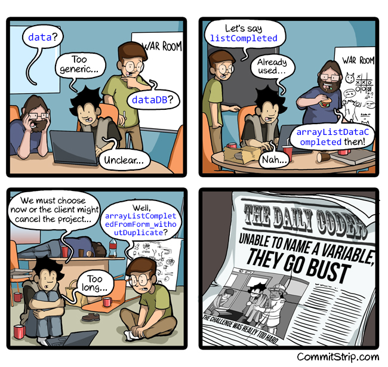

# MEANINGFUL NAMES

## Theory

Use intention revealing names




### Variables 

We should choose a name that specifies what is being measured and the unit of that measurement.
We should use pronouncable words (eg. ``functionPZQ`` ). There are some exceptions (eg. ``SSN``).

```java
 int d; // elapsed time in days.
```

should be transform into 

```java
 int elaspedTimeInDays
``` 

### Classes

As variable names, class names should be representative of business vocabulary.
Classes and objects should have noun or noun phrase names like ``Customer``, ``WikiPage``, ``Account``, and ``AddressParser``.
Avoid words like ``Manager``, ``Processor``, ``Data``, or ``Info`` in the name of a class.
A class name should __NOT be a verb__.

### Methods

Methods should have verb or verb phrase names like ``postPayment``, ``deletePage``, or ``save``.
Accessors, mutators, and predicates should be named for their value and prefixed with get, set.

### Pick One Word per Concept
Pick one word for one abstract concept and stick with it. 
For instance, it’s confusing to have fetch, retrieve, and get as equivalent methods of different classes.
How do you remember which method name goes with which class? 
Likewise, it’s confusing to have a controller and a manager and a driver in the same code base. 
What is the essential difference between a ``DeviceManager`` and a ``Protocol- Controller``?

## Katas

Review all the classes which are in the package [``...bad``](src/main/java/info/touret/workshop/cleancode/meaningfulname/bad) .
Copy them into the [``...good``](src/main/java/info/touret/workshop/cleancode/meaningfulname/good) one and fix them regarding the advices given in this chapter.


__[Next Chapter : Functions](../02-functions/README.md)__
