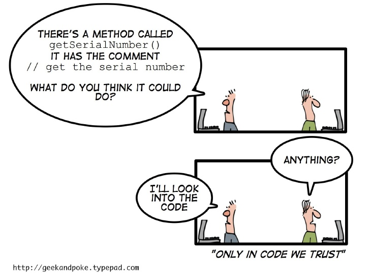

# COMMENTS

## Theory



The proper use of comments is to compensate for our failure to express ourselves in code.
So when you find yourself in a position where you need to write a comment, think it through and see whether there isn't some way to turn the tables and express yourself in code.

Code changes and evolves, but comments don't always follow them and And all too often the comments get separated from the code they describe and become orphaned blurbs of everdecreasing accuracy

## Good comments

### Legal Comments
```java
/*
 * Copyright (c) Worldline 2017 - All Rights Reserved.
 * Unauthorized copying of this file, via any medium is strictly prohibited
 * Proprietary and confidential
 *
 */
```
### Informatives Comments

Ex: For explain the return value of an abstract method
```java
/**
*Returns an instance of Responder being tested
*/
protected abstract Responder responderInstance();
```

### Explanation of Intent

Sometimes it is useful to provide basic information with a comment.
For example :
```java
/**
*return Coordinates in cartesian coordinate system
*/
public Coordinates getCoordiantes();
```
But it is better to use the name of the function to convey the information as much as possible.
```java
public Coordinates getCartesianCoordiantes();
```

### Warning of Consequences

Ex:
```java
// Don't run unless you
// have some time to kill
public void testWithBigFile(){
writeLinesToFile(10000000);
}
```

### TODO Comments

It is sometimes reasonable to leave “To do” notes in the form of TODO comments.
For example to explains what the function's future should be.

### Javadocs in public APIs

## Katas

Review all the classes which are in the package [``...bad``](src/main/java/info/touret/workshop/cleancode/comments/bad) .
Copy them into the [``...good``](src/main/java/info/touret/workshop/cleancode/comments/good) one and fix them regarding the advices given in this chapter.


__[Next Chapter : Formatting](../04-formatting/README.md)__
